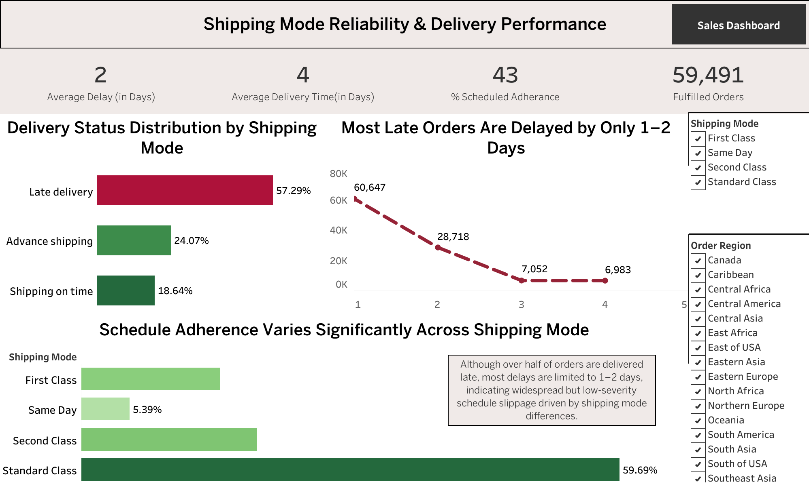
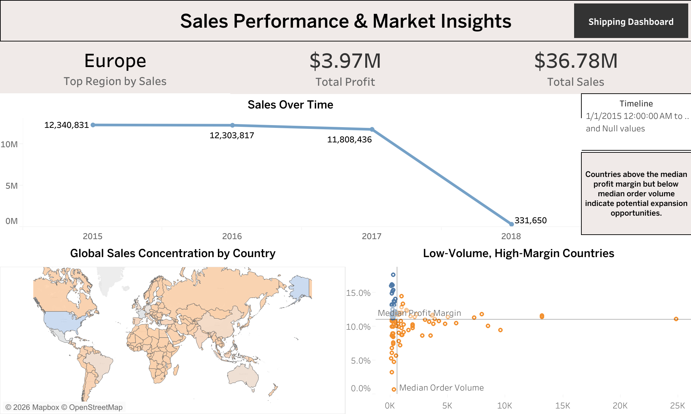

# 📦 Supply Chain & Sales Performance Analysis

## 📌 Project Overview
This project analyzes a global supply chain dataset to evaluate delivery reliability, sales performance, and regional market opportunities. The objective is to understand operational bottlenecks, analyze sales behavior across regions, forecast future sales, and identify low-volume, high-profit markets that may represent potential growth opportunities.

The project combines data cleaning, SQL-based exploratory analysis, time-series forecasting, and interactive dashboards to convert raw operational data into business insights.

📽️ Full Project Walkthrough (Video): https://youtu.be/WkvojrfDX7k

---

## 🎯 Problem Statement
The key goals of this project were to:
- Understand the structure and performance of a global supply chain  
- Identify whether specific regions or shipping modes are responsible for delivery delays  
- Analyze sales behavior across regions and countries  
- Forecast sales for the next year  
- Detect countries with low order volume but high profit margins indicating potential growth opportunities  

---

## 🧠 Approach & Methodology

### 1. Data Cleaning & Preparation
- Performed initial data cleaning using **Google Sheets**
- Handled missing values, inconsistent formats, and basic data quality issues
- Validated column definitions and business context using the data dictionary

---

### 2. Exploratory Analysis & Sales Forecasting (Python)
- Used **Google Colab** for exploratory analysis
- Aggregated sales data at a monthly level
- Built a time-series forecasting model using **Facebook Prophet**
- Generated sales forecasts for the next year

---

### 3. SQL-Based Exploratory Analysis (BigQuery)
- Wrote SQL queries in **Google BigQuery** to analyze:
  - Delivery delays and fulfillment performance
  - Regional and country-level sales distribution
  - Late delivery patterns across shipping modes and regions
- Used **window functions selectively** for:
  - Ranking entities (customers, regions, products)
  - Comparing sequential trends such as month-over-month sales

---

### 4. Visualization & Insights (Tableau)
Designed interactive Tableau dashboards to communicate insights clearly and concisely.

---

## 📊 Dashboards

### 🚚 Shipping Reliability & Delivery Performance
This dashboard focuses on operational efficiency and delivery execution.

**Key Metrics & Insights:**
- Average delivery time and average delay
- Scheduled adherence percentage
- Fulfilled orders count
- Delay patterns by shipping mode

---

### 💰 Sales Performance & Market Insights
This dashboard focuses on revenue trends, geographic performance, and growth opportunities.

**Key Metrics & Insights:**
- Total sales, total profit, and profit margin
- Monthly sales trends
- Global sales concentration by country
- Identification of low-volume, high-margin countries

---

## 🛠 Tools & Technologies
- **Google Sheets** – Data cleaning and validation  
- **Python (Google Colab)** – Exploratory analysis and sales forecasting using Prophet  
- **SQL (Google BigQuery)** – Exploratory data analysis and metric validation  
- **Tableau** – Interactive dashboards and data visualization  

---

## 🔍 SQL Analysis Highlights
- Used aggregate queries for core exploratory metrics
- Applied window functions selectively for ranking and trend comparison
- Focused on clarity and interpretability over over-engineering

---

## 🚀 Future Improvements
- Design a dimensional data model (fact orders, fact shipments, dimension tables)
- Automate data ingestion into a cloud data warehouse
- Enhance sales forecasting with additional external factors
- Implement anomaly detection for delivery delays and sales trends

---

## 📌 Key Takeaways
- Identified that **over 50% of orders were delivered late**, with delays primarily concentrated within specific shipping modes rather than uniformly across regions.  
- Found that **sales revenue is heavily concentrated in a small number of regions**, indicating potential geographic dependency risk.  
- Forecasted **next-year sales trends** using time-series modeling (Prophet) to support demand planning and revenue visibility.  
- Detected **countries with low order volumes but above-average profit margins**, highlighting potential expansion opportunities beyond top-selling markets.  
- Demonstrated the integration of **SQL (BigQuery), Python forecasting, and Tableau dashboards** to convert operational data into actionable business insights.    

---

## 📎 Notes
This project was designed as an exploratory analysis. Formal data modeling and pipeline automation were intentionally scoped as future enhancements to maintain analytical focus.
